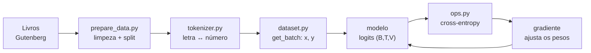

<p align="center">
  
</p>

<p align="center">
  
  
  
  
  
  
</p>

<h3 align="center">Um LLM estilo GPT construído do zero, peça por peça, para entender como funciona.</h3>

<p align="center">
  O Curupira tem os pés virados para trás.<br>
  O nosso modelo é <b>causal</b>: só olha para trás para prever o próximo token.
</p>

---

## A ideia

Um GPT faz uma coisa só: **recebe um pedaço de texto e chuta o próximo caractere**. Repetindo isso, ele escreve. Este repositório constrói esse mecanismo do zero, sem atalhos:

- **só `torch`, `numpy` e `matplotlib`**;
- **nada de HuggingFace, `transformers` ou `tiktoken`**;
- tokenizer, atenção, função de perda e otimizador **implementados à mão**;
- **roda em CPU**, com modelos pequenos e um corpus de poucos MB;
- **tudo tipado**, verificado com pyright;
- cada tensor tem o **shape comentado** em cada passo:

```python
logits = self.table[idx]  # row lookup: (B, T) -> (B, T, V)
```

O corpus são oito romances de **Machado de Assis** em domínio público, na ortografia original: o modelo aprende a escrever "elle", "commigo" e "Braz".

## Como funciona o caminho dos dados



## Resultados até agora

<picture>
  <source media="(prefers-color-scheme: dark)" srcset="assets/phase2_loss_dark.png">
  
</picture>

A **loss** mede a surpresa do modelo diante da letra certa: quanto menor, melhor.

| Modelo | Parâmetros | Loss treino | Loss validação |
|---|---:|---:|---:|
| Chute uniforme (não sabe nada) | 0 | 4,754 | 4,754 |
| Bigram por contagem (o melhor possível) | — | 2,345 | **2,367** |
| Bigram treinado com SGD | 13.456 | 2,351 | 2,372 |
| Uma cabeça de self-attention | 35.444 | 2,296 | 2,323 |
| 1 bloco Transformer | 244.340 | 1,856 | 1,898 |
| 4 blocos Transformer (SGD, 1500 passos) | 838.004 | 1,849 | 1,887 |
| **Mesmo modelo com AdamW, 4000 passos** | 838.004 | 1,413 | **1,452** |

O treino, sozinho, **redescobriu as estatísticas do livro**: chegou ao mesmo número que se obtém contando pares de letras. A tabela aprendida faz sentido — depois de `q` vem `u` com 100%, e depois de uma quebra de linha vem `-` em 48% dos casos, porque os diálogos de Machado começam com `--`.

<details>
<summary><b>Texto gerado pelo bigram</b> (clique para abrir)</summary>

```
-misosmosizeuem ea gr enço, eve, laca ccase Sia. eme Pomide frra to laeraeru
ado nom ceuveres po ssoma a uss, de erdasaredave ara, quistres s os menda pr
```

Tem cara de português, mas não diz nada: sem memória além da letra anterior, não se formam palavras. **O número a bater nas próximas fases é 2,37.**

</details>

### A atenção, olhando só para trás

Cada posição distribui 100% da sua atenção entre as posições **anteriores** — o triângulo de cima é sempre zero. Depois de treinar, a cabeça aprende a procurar o que importa:

```
              D    o    m    _    C    a    s    m    u    r    r    o   <- lido
      D |  100    .    .    .    .    .    .    .    .    .    .    .
      o |   49   51    .    .    .    .    .    .    .    .    .    .
      m |   90    9    1    .    .    .    .    .    .    .    .    .
      _ |    0    0   99    1    .    .    .    .    .    .    .    .
      C |    1    0    0    2   97    .    .    .    .    .    .    .
      u |    1    3    4    0    1    1    4   62   24    .    .    .
      r |    1    0    0    2    0    0    1    0    0   74   20    .
```

<details>
<summary><b>Texto gerado com uma cabeça de atenção</b></summary>

```
---Nãe sium que a gre va puevetre. Te cas oria. a e ses fifre das la.
---ma de num ceuver e petisom, apussaide vressareda porra, quu daçã saponue
```

Ainda é conversa fiada, mas já aparecem "Não", "que a" e sílabas mais longas.

</details>

### O bloco Transformer

<picture>
  <source media="(prefers-color-scheme: dark)" srcset="assets/phase4_loss_dark.png">
  
</picture>

Quatro peças, cada uma resolvendo um limite da cabeça única:

| Peça | O que resolve |
|---|---|
| **Multi-head** | Várias perguntas ao mesmo tempo: uma cabeça acompanha a palavra anterior, outra a pontuação, outra o começo da frase |
| **MLP** | Depois de buscar a informação, é preciso *pensar* sobre ela; a atenção só faz médias ponderadas |
| **Residual** | `x + f(x)`: uma via expressa que deixa o gradiente chegar às primeiras camadas sem encolher |
| **LayerNorm** | Mantém os números em escala sã (média 0, desvio 1) a cada camada, senão pilhas fundas explodem |

<details>
<summary><b>Texto gerado com 4 blocos</b></summary>

```
--Ph! umplo; Maescielonjudeu-lhe famou-o que estrado, pares, manco não um
xincesto, debosse Ho é algunessano um pouco com que no esque erquito. Até
quere forque sente algummentardar. Não abamis.
```

Agora há palavras inteiras e corretas ("que", "não", "um pouco com que", "sente"), pontuação no lugar e travessões de diálogo. A sintaxe ainda não se sustenta — é o que as fases 5 a 7 vão atacar.

</details>

### Treino de verdade

<picture>
  <source media="(prefers-color-scheme: dark)" srcset="assets/phase5_loss_dark.png">
  
</picture>

Mesmo modelo da fase 4, só trocando **como** ele é treinado:

- **AdamW à mão**: além do momento, guarda a média dos gradientes **ao quadrado** e dá a cada parâmetro seu próprio tamanho de passo, com correção de viés e *weight decay* desacoplado. Confere com o `torch.optim.AdamW` até 2e-7.
- **Warmup + cosine decay**: a taxa sobe do zero nos primeiros 200 passos (os pesos ainda são aleatórios; um passo grande ali estraga tudo) e depois desce suavemente, para o modelo assentar em vez de ficar quicando.

<picture>
  <source media="(prefers-color-scheme: dark)" srcset="assets/phase5_lr_dark.png">
  
</picture>

Nos **mesmos 1500 passos** da fase 4, o AdamW chega a **1,708** onde o SGD chegava a 1,887.

<details>
<summary><b>Texto gerado depois do treino de verdade</b></summary>

```
--Pedro.
--Ah!
Cuja longe eu dizia morrer á leitudade parente.
Não não lhe lhe deitado o seu nama commendino. Ao das mesmolores desatropriamos.
Até que elle entrou e cara amor, ideia dandançass.
--Isto me pasantee guatente consumnicar-se a toda a escalibilidade fosse, se não
vaes dos apazes; foi uma cauta de pontadas esperal-a; o vento da Alamestidade
```

Diálogo com travessão, nomes próprios, vírgulas e pontos no lugar certo, e trechos inteiros de português correto ("Até que elle entrou", "se não vaes dos"). O modelo ainda inventa palavras, porque enxerga letra por letra — é o que o BPE da fase 7 ataca.

</details>

## Roteiro

| Fase | Conteúdo | Status |
|---|---|:---:|
| 1 | Corpus, tokenizer char-level, split e `get_batch` | ✅ |
| 2 | Baseline bigram, cross-entropy e SGD à mão | ✅ |
| 3 | Self-attention: uma cabeça, passo a passo | ✅ |
| 4 | Bloco Transformer: multi-head, MLP, residual, LayerNorm | ✅ |
| 5 | Treino de verdade: AdamW, warmup + cosine, checkpoints | ✅ |
| 6 | Geração: temperature e top-k | 🚧 |
| 7 | Upgrades modernos: BPE, RoPE, RMSNorm, SwiGLU, KV-cache | ⏳ |

## Começando

```bash
python -m venv .venv
.venv/bin/pip install torch numpy matplotlib

.venv/bin/python -m scripts.prepare_data          # baixa e limpa o corpus (uma vez)
.venv/bin/python -m scripts.phase1 --device cpu   # inspeciona dados e tokenizer
.venv/bin/python -m scripts.phase2 --device cpu   # treina o bigram (~1 min)
.venv/bin/python -m scripts.phase3 --device cpu   # self-attention passo a passo (~3 min)
.venv/bin/python -m scripts.phase4 --device cpu   # blocos Transformer (~20 min; 30 s em GPU)
.venv/bin/python -m scripts.phase5                # treino de verdade + checkpoints (~1 min em GPU)
```

Sem a flag `--device`, o código usa a GPU se houver. Tempos medidos nesta máquina (Core Ultra 9 275HX com 24 threads, RTX 5060):

| Script | CPU | GPU |
|---|---:|---:|
| `phase4` (1500 passos, dois modelos) | ~20 min | 30 s |
| `phase5` (4000 passos) | ~80 min (~1,1 s/passo) | 1 min |

Tudo roda em CPU; só demora. Para experimentar a fase 5 em CPU, `--steps 1000 --warmup 100` leva ~20 min.

## Organização

```
curupira/            a biblioteca
  tokenizer.py       CharTokenizer: cada caractere vira um inteiro
  dataset.py         load_data, get_batch (x: (B,T), y: (B,T)), pick_device
  ops.py             cross_entropy, LayerNorm e os otimizadores SGD e AdamW, à mão
  training.py        estimate_loss, agendamento da taxa (warmup + cosine)
  checkpoint.py      ModelConfig, save_checkpoint e load_checkpoint
  plots.py           gráficos em versão clara e escura
  models/
    bigram.py        BigramLM: uma tabela (V, V)
    attention.py     Head: uma cabeça causal + AttentionLM
    transformer.py   MultiHeadAttention, FeedForward, Block e GPT
scripts/             um script por fase: só orquestra, mede e imprime
  prepare_data.py  phase1.py … phase5.py
assets/              banner e gráficos do README
data/                corpus baixado (fora do versionamento)
checkpoints/         modelos salvos: best.pt e um a cada 1000 passos (fora do versionamento)
```

Código, nomes e comentários em inglês; documentação e explicações em português. `data/` e `checkpoints/` não são versionados.

## Verificando os tipos

```bash
npx --yes pyright@latest --pythonpath .venv/bin/python .
```

## Licença

MIT — veja [LICENSE](LICENSE).
