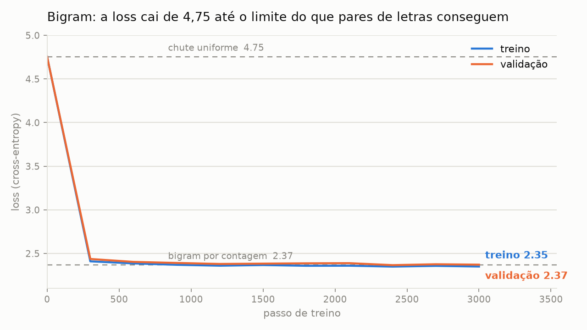
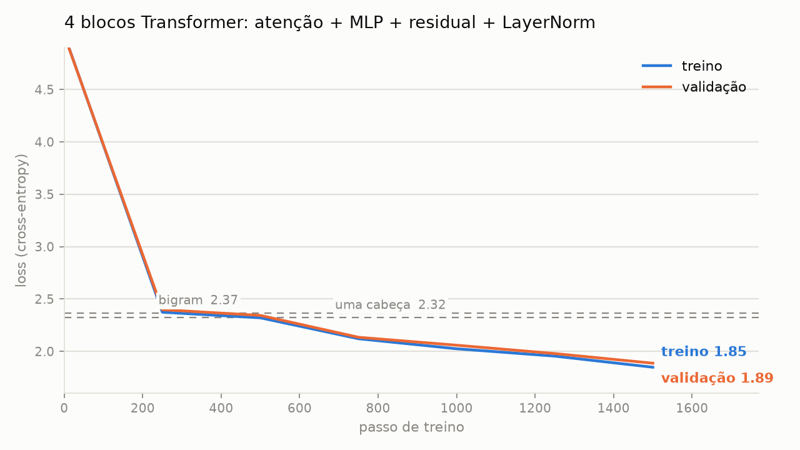
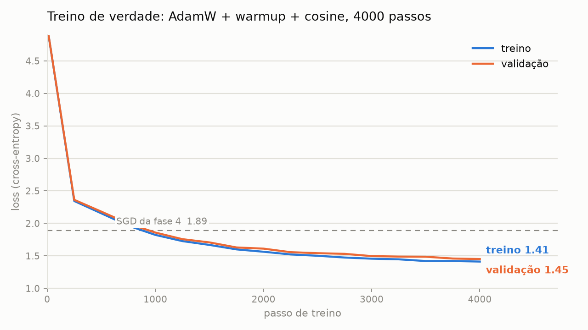
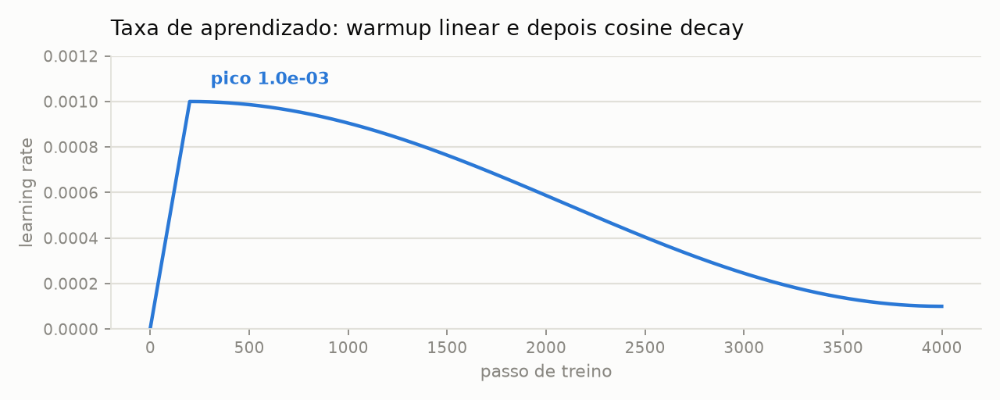
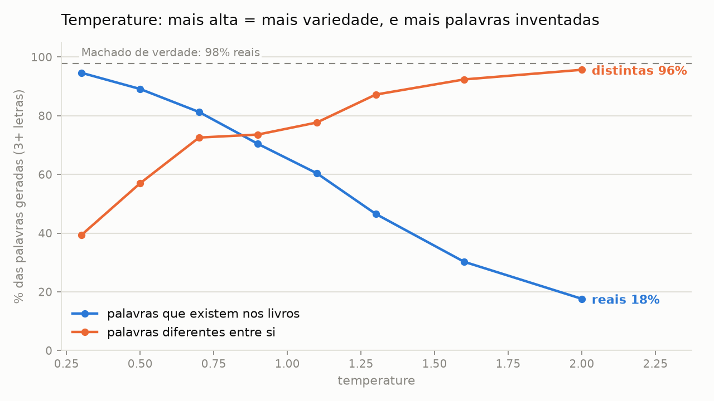

<p align="center">
  
</p>

<p align="center">
  
  
  
  
  
  
</p>

<h3 align="center">Um LLM estilo GPT construído do zero, peça por peça, para entender como funciona.</h3>

<p align="center">
  O Curupira tem os pés virados para trás.<br>
  O nosso modelo é <b>causal</b>: só olha para trás para prever o próximo token.
</p>

---

## A ideia

Um GPT faz uma coisa só: **recebe um pedaço de texto e chuta o próximo caractere**. Repetindo isso, ele escreve. Este repositório constrói esse mecanismo do zero, sem atalhos:

- **só `torch`, `numpy` e `matplotlib`**;
- **nada de HuggingFace, `transformers` ou `tiktoken`**;
- tokenizer, atenção, função de perda e otimizador **implementados à mão**;
- **roda em CPU**, com modelos pequenos e um corpus de poucos MB;
- **tudo tipado**, verificado com pyright;
- cada tensor tem o **shape comentado** em cada passo:

```python
logits = self.table[idx]  # row lookup: (B, T) -> (B, T, V)
```

O corpus são oito romances de **Machado de Assis** em domínio público, na ortografia original: o modelo aprende a escrever "elle", "commigo" e "Braz".

## Como funciona o caminho dos dados


## Resultados até agora

<picture>
  <source media="(prefers-color-scheme: dark)" srcset="assets/phase2_loss_dark.png">
  
</picture>

A **loss** mede a surpresa do modelo diante da letra certa: quanto menor, melhor.

| Modelo | Parâmetros | Loss treino | Loss validação |
|---|---:|---:|---:|
| Chute uniforme (não sabe nada) | 0 | 4,754 | 4,754 |
| Bigram por contagem (o melhor possível) | — | 2,345 | **2,367** |
| Bigram treinado com SGD | 13.456 | 2,351 | 2,372 |
| Uma cabeça de self-attention | 35.444 | 2,296 | 2,323 |
| 1 bloco Transformer | 244.340 | 1,856 | 1,898 |
| 4 blocos Transformer (SGD, 1500 passos) | 838.004 | 1,849 | 1,887 |
| Mesmo modelo com AdamW, 4000 passos | 838.004 | 1,413 | 1,452 |
| Mesmo modelo e treino, tokenizer BPE de 1024 tokens | 1.071.360 | — | 1,306 por caractere ¹ |
| **BPE + RoPE no lugar da posição aprendida** | 1.054.976 | — | **1,246** por caractere ¹ |
| BPE + RoPE + RMSNorm no lugar do LayerNorm | 1.053.824 | — | 1,248 por caractere ¹ (empate) |

¹ Média de 2 sementes aleatórias.

O treino, sozinho, **redescobriu as estatísticas do livro**: chegou ao mesmo número que se obtém contando pares de letras. A tabela aprendida faz sentido — depois de `q` vem `u` com 100%, e depois de uma quebra de linha vem `-` em 48% dos casos, porque os diálogos de Machado começam com `--`.

<details>
<summary><b>Texto gerado pelo bigram</b> (clique para abrir)</summary>

```
-misosmosizeuem ea gr enço, eve, laca ccase Sia. eme Pomide frra to laeraeru
ado nom ceuveres po ssoma a uss, de erdasaredave ara, quistres s os menda pr
```

Tem cara de português, mas não diz nada: sem memória além da letra anterior, não se formam palavras. **O número a bater nas próximas fases é 2,37.**

</details>

### A atenção, olhando só para trás

Cada posição distribui 100% da sua atenção entre as posições **anteriores** — o triângulo de cima é sempre zero. Depois de treinar, a cabeça aprende a procurar o que importa:

```
              D    o    m    _    C    a    s    m    u    r    r    o   <- lido
      D |  100    .    .    .    .    .    .    .    .    .    .    .
      o |   49   51    .    .    .    .    .    .    .    .    .    .
      m |   90    9    1    .    .    .    .    .    .    .    .    .
      _ |    0    0   99    1    .    .    .    .    .    .    .    .
      C |    1    0    0    2   97    .    .    .    .    .    .    .
      u |    1    3    4    0    1    1    4   62   24    .    .    .
      r |    1    0    0    2    0    0    1    0    0   74   20    .
```

<details>
<summary><b>Texto gerado com uma cabeça de atenção</b></summary>

```
---Nãe sium que a gre va puevetre. Te cas oria. a e ses fifre das la.
---ma de num ceuver e petisom, apussaide vressareda porra, quu daçã saponue
```

Ainda é conversa fiada, mas já aparecem "Não", "que a" e sílabas mais longas.

</details>

### O bloco Transformer

<picture>
  <source media="(prefers-color-scheme: dark)" srcset="assets/phase4_loss_dark.png">
  
</picture>

Quatro peças, cada uma resolvendo um limite da cabeça única:

| Peça | O que resolve |
|---|---|
| **Multi-head** | Várias perguntas ao mesmo tempo: uma cabeça acompanha a palavra anterior, outra a pontuação, outra o começo da frase |
| **MLP** | Depois de buscar a informação, é preciso *pensar* sobre ela; a atenção só faz médias ponderadas |
| **Residual** | `x + f(x)`: uma via expressa que deixa o gradiente chegar às primeiras camadas sem encolher |
| **LayerNorm** | Mantém os números em escala sã (média 0, desvio 1) a cada camada, senão pilhas fundas explodem |

<details>
<summary><b>Texto gerado com 4 blocos</b></summary>

```
--Ph! umplo; Maescielonjudeu-lhe famou-o que estrado, pares, manco não um
xincesto, debosse Ho é algunessano um pouco com que no esque erquito. Até
quere forque sente algummentardar. Não abamis.
```

Agora há palavras inteiras e corretas ("que", "não", "um pouco com que", "sente"), pontuação no lugar e travessões de diálogo. A sintaxe ainda não se sustenta — é o que as fases 5 a 7 vão atacar.

</details>

### Treino de verdade

<picture>
  <source media="(prefers-color-scheme: dark)" srcset="assets/phase5_loss_dark.png">
  
</picture>

Mesmo modelo da fase 4, só trocando **como** ele é treinado:

- **AdamW à mão**: além do momento, guarda a média dos gradientes **ao quadrado** e dá a cada parâmetro seu próprio tamanho de passo, com correção de viés e *weight decay* desacoplado. Confere com o `torch.optim.AdamW` até 2e-7.
- **Warmup + cosine decay**: a taxa sobe do zero nos primeiros 200 passos (os pesos ainda são aleatórios; um passo grande ali estraga tudo) e depois desce suavemente, para o modelo assentar em vez de ficar quicando.

<picture>
  <source media="(prefers-color-scheme: dark)" srcset="assets/phase5_lr_dark.png">
  
</picture>

Nos **mesmos 1500 passos** da fase 4, o AdamW chega a **1,708** onde o SGD chegava a 1,887.

<details>
<summary><b>Texto gerado depois do treino de verdade</b></summary>

```
--Pedro.
--Ah!
Cuja longe eu dizia morrer á leitudade parente.
Não não lhe lhe deitado o seu nama commendino. Ao das mesmolores desatropriamos.
Até que elle entrou e cara amor, ideia dandançass.
--Isto me pasantee guatente consumnicar-se a toda a escalibilidade fosse, se não
vaes dos apazes; foi uma cauta de pontadas esperal-a; o vento da Alamestidade
```

Diálogo com travessão, nomes próprios, vírgulas e pontos no lugar certo, e trechos inteiros de português correto ("Até que elle entrou", "se não vaes dos"). O modelo ainda inventa palavras, porque enxerga letra por letra — é o que o BPE da fase 7 ataca.

</details>

### Geração: como escolher a próxima letra

O modelo não escreve: ele devolve uma probabilidade para cada um dos 116 caracteres, e **alguém precisa sortear um**. O jeito de sortear muda o texto sem mexer em nenhum peso.

- **Temperature** divide os scores antes do softmax. Abaixo de 1, a favorita fica ainda mais favorita; acima de 1, as chances se achatam.
- **Top-k** descarta tudo fora das `k` mais prováveis, cortando a "cauda longa" de letras improváveis que, somadas, ainda saem de vez em quando.

Depois de `"Capitu olhou para mim e "`, o modelo hesita entre ~18 caracteres (`a` 15%, `d` 12%, `p` 8%…). Com temperature 0,5 cai para ~9; com 1,5 sobe para ~26.

<picture>
  <source media="(prefers-color-scheme: dark)" srcset="assets/phase6_temperature_dark.png">
  
</picture>

Medindo 3.200 caracteres gerados por configuração (palavras de 3+ letras):

| Configuração | Palavras que existem nos livros | Palavras distintas |
|---|---:|---:|
| Machado de verdade | 97,8% | 61,0% |
| temperature 0,3 | 94,7% | 39,3% |
| temperature 0,7 | 81,3% | 72,6% |
| temperature 0,9 | 70,4% | 73,6% |
| temperature 1,3 | 46,5% | 87,2% |
| temperature 2,0 | 17,6% | 95,7% |
| **temperature 0,8 + top-k 20** | **73,3%** | **75,8%** |

Não existe configuração que ganhe nas duas colunas: é uma troca entre **acertar** e **variar**. No extremo, o *greedy* (sempre a mais provável) entra em loop:

```
... A mesma cousa de casa. A mesma cousa de casa. A mesma cousa de casa. A mesma cousa de casa.
```

<details>
<summary><b>O mesmo prompt em três momentos do treino</b> (temperature 0,8, top-k 20, mesma semente)</summary>

**Passo 1000** — loss 1,859, 43% de palavras reais
```
Capitu olhou para mim e ande de mais escretosenciantos agre um crespou. Não vaspelho,
de phivia a costo da e casa elle semeda. Eu a vija ella a estimente-te.
```

**Passo 2000** — loss 1,612, 63% de palavras reais
```
Capitu olhou para mim e andar. O maria de alguns boltas, que estreveu para elle..
Esteve não sera com medico, não sem póde da verdade parel-a.
```

**Passo 4000** — loss 1,451, 73% de palavras reais
```
Capitu olhou para mim e andar. O mettes já o seu bom de Escobar, annos e o capitel-o,
de philosopho de que eu não escreverada. Eu abriu-se a mão para almato.
```

No passo 4000 aparece **Escobar**, o amigo de Bentinho em *Dom Casmurro* — o modelo associou o nome ao contexto de Capitu.

</details>

### Upgrade 7a: tokenizer BPE, escrito à mão

Até aqui cada token era **uma letra**: "casamento" custava 9 previsões. O **BPE** (*byte-pair encoding*) parte das letras e, repetidamente, cola o **par vizinho mais frequente** num token novo, até o vocabulário chegar ao tamanho pedido. Os primeiros merges aprendidos em Machado:

```
' ' + 'd' -> ' d'      ' d' + 'e' -> ' de'      'q' + 'u' -> 'qu'      'qu' + 'e' -> 'que'
```

Com 1024 tokens, palavras frequentes viram **um token só** (`' perguntou'`, `' respondeu'`, `' coração'`) e palavras raras são soletradas em pedaços, então nenhum texto fica impossível de codificar:

```
letras (61 tokens): |-|-|N|ã|o| |c|o|n|s|u|l|t|e|s| |d|i|c|c|i|o|n|a|r|i|o|s|,| |d|i|s|s|e| ...
BPE    (22 tokens): |--|Não| cons|ult|es| d|ic|cio|n|ar|ios|,| disse| C|apit|u|,| olh|ando| para| mim|.|
```

| Vocabulário | Caracteres por token | Texto que cabe em 128 tokens |
|---:|---:|---:|
| 116 (letras) | 1,00 | 128 caracteres |
| 512 | 2,25 | 289 caracteres |
| **1024** | **2,69** | **345 caracteres** |
| 2048 | 3,13 | 401 caracteres |

O treino do BPE no corpus inteiro leva 3 segundos, usando contagem **incremental** de pares. Conferi contra uma versão ingênua que reconta tudo a cada merge: 284 de 284 escolhas iguais. A ida e volta `decode(encode(texto)) == texto` também foi conferida no texto de treino inteiro.

**Como comparar de forma justa.** Errar um token BPE é errar ~2,7 letras de uma vez, então loss por token e loss por letra não são comparáveis. A medida justa é a **loss por caractere** = loss por token ÷ caracteres por token. Mesmo modelo, mesmo treino (4000 passos, AdamW):

| Tokenizer | Loss por token | **Loss por caractere** | Parâmetros |
|---|---:|---:|---:|
| Letras (fase 5) | 1,452 | 1,452 | 838.004 |
| **BPE 1024** | 3,473 | **1,309 (-9,8%)** | 1.071.360 |

O custo por passo mal muda (medido em CPU: 488 ms com letras, 513 ms com BPE). O ganho vem de o modelo **enxergar ~2,7× mais texto** na mesma janela de 128 posições, e de não gastar capacidade soletrando.

**O preço:** com BPE, os livros viram só 920 mil tokens, e os 4000 passos passam ~18 vezes por eles. A distância entre treino e validação, por caractere, **dobrou** (0,039 → 0,075): o modelo começou a decorar. Com um corpus tão pequeno, esse é o limite do BPE.

| Configuração de geração | Palavras reais | Palavras distintas |
|---|---:|---:|
| Letras, temperature 1,0 | 59,7% | 80,4% |
| **BPE 1024, temperature 1,0** | **78,1%** | 76,6% |
| Letras, temperature 0,8 + top-k 20 | 73,3% | 75,8% |
| BPE 1024, temperature 0,8 + top-k 20 | 93,5% | 46,7% |

Sem top-k, o BPE escreve muito mais palavras reais com variedade parecida. Com top-k 20 ele fica repetitivo, porque escolher entre 20 **tokens** (que valem várias letras) é bem mais restritivo do que escolher entre 20 letras: um ajuste de geração não se transporta automaticamente de um tokenizer para outro.

<details>
<summary><b>Texto gerado com BPE</b></summary>

```
Capitu olhou para mim e ridiculado. Não é a ninguem; é verdade. Um dia, se amo não era
ingleza. Tinha que eu gostava, como se podia ser muito. Então não querendo. Ayres não sei
que ha mais, é a minha declaração, que já a moça não era indole do ceu.
```

Frases inteiras com sujeito e verbo, e **Ayres**, o narrador de *Esaú e Jacó* e *Memorial de Aires*.

</details>

### Upgrade 7b: RoPE, posição por rotação

Desde a fase 3, o modelo sabia **onde** cada token está somando a ele um vetor treinável por posição: um para o slot 0, outro para o slot 1… O problema é que "a palavra logo antes de mim" é a mesma relação no slot 3 e no slot 150, mas com vetores aprendidos o modelo precisa descobrir isso **separadamente para cada posição**.

O **RoPE** (*rotary position embedding*) joga fora esses vetores. Em cada cabeça de atenção, divide a query e a key em pares de números e **gira** cada par por um ângulo proporcional à posição, cada par numa velocidade diferente, como os ponteiros de um relógio. O value não gira: a posição decide **quem** olhar, não **o que** passar adiante.

A propriedade que faz tudo funcionar: depois de girar, o produto `query · key` **só depende da distância** entre as posições.

```
 query na posição | key na posição | distância |    q · k
                3 |              1 |         2 |   0.0337
               50 |             48 |         2 |   0.0337
              150 |            148 |         2 |   0.0337
               10 |              5 |         5 |   0.6681
              120 |            115 |         5 |   0.6681
```

Conferido contra a rotação feita com números complexos (diferença de 2e-7), e com a propriedade da distância valendo em todas as posições.

**Medição honesta.** Uma única rodada pode ganhar por sorte, então as duas versões foram treinadas com **duas sementes aleatórias**, mesmos dados (BPE 1024) e mesma receita:

| Posição | Semente 1337 | Semente 2024 | **Média (loss por caractere)** | Treino → validação | Parâmetros |
|---|---:|---:|---:|---:|---:|
| Aprendida | 1,3086 | 1,3030 | 1,3058 | 0,074 | 1.071.360 |
| **RoPE** | 1,2388 | 1,2529 | **1,2458 (-4,6%)** | 0,167 | 1.054.976 |

O RoPE venceu nas duas sementes, por uma diferença (0,060) **quatro vezes maior** que a variação entre sementes (0,014), e com 16 mil parâmetros **a menos**.

**O preço:** ele aprende mais rápido, e também decora mais rápido. A distância entre treino e validação mais que dobrou, e na semente 2024 a validação chegou a 1,2529 e **voltou a subir** para 1,2633 no fim do treino. Com 3 MB de texto, o modelo já está no limite do que dá para aprender sem decorar.

<details>
<summary><b>Texto gerado com RoPE</b> (temperature 1,0, sem top-k)</summary>

```
Capitu olhou para mim e ri-lhe que, de lhe escuviv talento ja a partes e menina.
--Digo-lhe que não perde em gatero; são amavam muito.
--Ora odio ao sacristão, e pelo proprio é a deixar o imperador, já a traição de inesperado...
```

90,2% de palavras reais e 74,2% distintas, contra 78,1% e 76,6% da posição aprendida.

</details>

### Upgrade 7c: RMSNorm, e um empate

O LayerNorm faz duas coisas com o vetor de cada token: **centraliza** (tira a média) e **escala** (divide pelo desvio). O **RMSNorm** faz só a segunda: divide pela raiz da média dos quadrados, e dispensa o deslocamento aprendido `beta`. A aposta é que o que estabiliza o treino é controlar a **escala**; a média não importaria tanto.

```
um vetor qualquer:          [+2.00, -1.00, +0.50, +3.50]
  LayerNorm -> [+0.45, -1.34, -0.45, +1.34]
  RMSNorm   -> [+0.96, -0.48, +0.24, +1.67]
o mesmo vetor, +5 em tudo:  [+7.00, +4.00, +5.50, +8.50]
  LayerNorm -> [+0.45, -1.34, -0.45, +1.34]   <- igual: ele centraliza
  RMSNorm   -> [+1.08, +0.62, +0.85, +1.31]   <- mudou: ele não centraliza
```

Mesma medição da 7b, agora com RoPE nas duas versões:

| Normalização | Semente 1337 | Semente 2024 | **Média (loss por caractere)** | Parâmetros |
|---|---:|---:|---:|---:|
| LayerNorm | 1,2388 | 1,2529 | **1,2458** | 1.054.976 |
| RMSNorm | 1,2427 | 1,2540 | 1,2484 (+0,2%) | 1.053.824 |

**Veredito: empate.** O RMSNorm ficou um fio atrás nas duas sementes, mas a diferença (0,0025) é **cinco vezes menor** que a variação entre sementes (0,014). Com essa medição não dá para dizer que ele é pior, nem melhor. A linha de base reproduziu exatamente os números da 7b, e o texto gerado também empatou (89,1% de palavras reais contra 90,2%).

**Então por que os LLMs modernos usam RMSNorm?** Não é pela loss, é pelo **custo**: uma conta a menos (não calcula nem subtrai a média) em cada uma das 9 normalizações, a cada passo. Nos nossos treinos na GPU, feitos intercalados, cada treino com RMSNorm levou **~73 s**, contra **79–83 s** com LayerNorm. Em modelos com bilhões de parâmetros, essa economia sem perder qualidade é o que conta.

A lição: **nem todo upgrade melhora a loss**. Alguns trocam custo por qualidade igual, e só uma medição com mais de uma semente mostra a diferença entre "não ajudou" e "atrapalhou".

## Roteiro

| Fase | Conteúdo | Status |
|---|---|:---:|
| 1 | Corpus, tokenizer char-level, split e `get_batch` | ✅ |
| 2 | Baseline bigram, cross-entropy e SGD à mão | ✅ |
| 3 | Self-attention: uma cabeça, passo a passo | ✅ |
| 4 | Bloco Transformer: multi-head, MLP, residual, LayerNorm | ✅ |
| 5 | Treino de verdade: AdamW, warmup + cosine, checkpoints | ✅ |
| 6 | Geração: temperature e top-k | ✅ |
| 7 | Upgrades modernos, um de cada vez: **BPE ✅**, **RoPE ✅**, **RMSNorm ✅**, SwiGLU, KV-cache | 🚧 |

## Começando

```bash
python -m venv .venv
.venv/bin/pip install torch numpy matplotlib

.venv/bin/python -m scripts.prepare_data          # baixa e limpa o corpus (uma vez)
.venv/bin/python -m scripts.phase1 --device cpu   # inspeciona dados e tokenizer
.venv/bin/python -m scripts.phase2 --device cpu   # treina o bigram (~1 min)
.venv/bin/python -m scripts.phase3 --device cpu   # self-attention passo a passo (~3 min)
.venv/bin/python -m scripts.phase4 --device cpu   # blocos Transformer (~20 min; 30 s em GPU)
.venv/bin/python -m scripts.phase5                # treino de verdade + checkpoints (~1 min em GPU)
.venv/bin/python -m scripts.phase6 --device cpu   # temperature, top-k e 3 checkpoints (~3 min)
.venv/bin/python -m scripts.phase7a_bpe           # tokenizer BPE + treino comparado (~1 min em GPU)
.venv/bin/python -m scripts.phase7b_rope          # RoPE vs posição aprendida, 2 sementes (~5 min em GPU)
.venv/bin/python -m scripts.phase7c_rmsnorm       # RMSNorm vs LayerNorm, 2 sementes (~5 min em GPU)

# brinque com o modelo treinado
.venv/bin/python -m scripts.generate --prompt "Capitu olhou para mim e " --temperature 0.8 --top-k 20
```

Sem a flag `--device`, o código usa a GPU se houver. Tempos medidos nesta máquina (Core Ultra 9 275HX com 24 threads, RTX 5060):

| Script | CPU | GPU |
|---|---:|---:|
| `phase4` (1500 passos, dois modelos) | ~20 min | 30 s |
| `phase5` (4000 passos) | ~80 min (~1,1 s/passo) | 1 min |
| `phase6` (só geração, sem treino) | 3 min | — |
| `phase7a_bpe` (4000 passos) | ~80 min (custo por passo +5% vs. letras) | 1 min |
| `phase7b_rope` (4 treinos de 4000 passos) | não medido ² | 5 min (cada treino com RoPE ~25% mais lento) |
| `phase7c_rmsnorm` (4 treinos de 4000 passos) | não medido ³ | 5 min (cada treino com RMSNorm ~8% mais rápido) |

² A máquina estava ocupada por outros processos durante a medição (load average 27 em 24 núcleos) e os tempos variaram mais de 10× entre rodadas; preferi não publicar um número não confiável. Em CPU, `--seeds 1337 --steps 1000` reduz a fase a 2 treinos curtos.

³ Com a máquina livre, a mediana deu RMSNorm ~5% mais rápido por passo em CPU (1272 contra 1344 ms), mas as rodadas do mesmo modelo variaram 2×: a diferença é menor que o ruído da medição.

Tudo roda em CPU; só demora. Para experimentar a fase 5 em CPU, `--steps 1000 --warmup 100` leva ~20 min.

## Organização

```
curupira/            a biblioteca
  tokenizer.py       Tokenizer (Protocol) e CharTokenizer: cada caractere vira um inteiro
  bpe.py             BPETokenizer: merges de pares frequentes, escrito à mão
  dataset.py         load_texts, encode_splits, get_batch (x: (B,T), y: (B,T)), pick_device
  ops.py             cross_entropy, LayerNorm, RMSNorm, RoPE e os otimizadores SGD e AdamW, à mão
  ablation.py        compara variantes com as mesmas sementes: placar e veredito contra o acaso
  training.py        estimate_loss, agendamento da taxa, TrainConfig e train_model
  checkpoint.py      ModelConfig, save_checkpoint e load_checkpoint
  sampling.py        temperature, top-k, greedy e o sorteio da próxima letra
  text_stats.py      % de palavras reais e distintas no texto gerado
  plots.py           gráficos em versão clara e escura
  models/
    bigram.py        BigramLM: uma tabela (V, V)
    attention.py     Head: uma cabeça causal + AttentionLM
    transformer.py   MultiHeadAttention, FeedForward, Block e GPT (upgrades ligados por argumento)
scripts/             um script por fase: só orquestra, mede e imprime
  prepare_data.py  phase1.py … phase6.py  phase7a_bpe.py  phase7b_rope.py  phase7c_rmsnorm.py
  generate.py        gera texto a partir de um checkpoint salvo
assets/              banner e gráficos do README
data/                corpus baixado (fora do versionamento)
checkpoints/         modelos salvos: best.pt e um a cada 1000 passos (fora do versionamento)
```

Código, nomes e comentários em inglês; documentação e explicações em português. `data/` e `checkpoints/` não são versionados.

## Verificando os tipos

```bash
npx --yes pyright@latest --pythonpath .venv/bin/python .
```

## Licença

MIT — veja [LICENSE](LICENSE).
