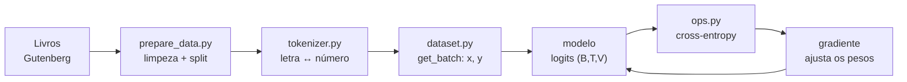

<p align="center">
  
</p>

<p align="center">
  
  
  
  
  
  
</p>

<h3 align="center">Um LLM estilo GPT construído do zero, peça por peça, para entender como funciona.</h3>

<p align="center">
  O Curupira tem os pés virados para trás.<br>
  O nosso modelo é <b>causal</b>: só olha para trás para prever o próximo token.
</p>

---

## A ideia

Um GPT faz uma coisa só: **recebe um pedaço de texto e chuta o próximo caractere**. Repetindo isso, ele escreve. Este repositório constrói esse mecanismo do zero, sem atalhos:

- **só `torch`, `numpy` e `matplotlib`**;
- **nada de HuggingFace, `transformers` ou `tiktoken`**;
- tokenizer, atenção, função de perda e otimizador **implementados à mão**;
- **roda em CPU**, com modelos pequenos e um corpus de poucos MB;
- **tudo tipado**, verificado com pyright;
- cada tensor tem o **shape comentado** em cada passo:

```python
logits = self.table[idx]  # row lookup: (B, T) -> (B, T, V)
```

O corpus são oito romances de **Machado de Assis** em domínio público, na ortografia original: o modelo aprende a escrever "elle", "commigo" e "Braz".

## Como funciona o caminho dos dados



## Resultados até agora

<picture>
  <source media="(prefers-color-scheme: dark)" srcset="assets/phase2_loss_dark.png">
  
</picture>

A **loss** mede a surpresa do modelo diante da letra certa: quanto menor, melhor.

| Modelo | Parâmetros | Loss treino | Loss validação |
|---|---:|---:|---:|
| Chute uniforme (não sabe nada) | 0 | 4,754 | 4,754 |
| Bigram por contagem (o melhor possível) | — | 2,345 | **2,367** |
| Bigram treinado com SGD | 13.456 | 2,351 | 2,372 |

O treino, sozinho, **redescobriu as estatísticas do livro**: chegou ao mesmo número que se obtém contando pares de letras. A tabela aprendida faz sentido — depois de `q` vem `u` com 100%, e depois de uma quebra de linha vem `-` em 48% dos casos, porque os diálogos de Machado começam com `--`.

<details>
<summary><b>Texto gerado pelo bigram</b> (clique para abrir)</summary>

```
-misosmosizeuem ea gr enço, eve, laca ccase Sia. eme Pomide frra to laeraeru
ado nom ceuveres po ssoma a uss, de erdasaredave ara, quistres s os menda pr
```

Tem cara de português, mas não diz nada: sem memória além da letra anterior, não se formam palavras. **O número a bater nas próximas fases é 2,37.**

</details>

## Roteiro

| Fase | Conteúdo | Status |
|---|---|:---:|
| 1 | Corpus, tokenizer char-level, split e `get_batch` | ✅ |
| 2 | Baseline bigram, cross-entropy e SGD à mão | ✅ |
| 3 | Self-attention: uma cabeça, passo a passo | 🚧 |
| 4 | Bloco Transformer: multi-head, MLP, residual, LayerNorm | ⏳ |
| 5 | Treino de verdade: AdamW, warmup + cosine, checkpoints | ⏳ |
| 6 | Geração: temperature e top-k | ⏳ |
| 7 | Upgrades modernos: BPE, RoPE, RMSNorm, SwiGLU, KV-cache | ⏳ |

## Começando

```bash
python -m venv .venv
.venv/bin/pip install torch numpy matplotlib

.venv/bin/python prepare_data.py          # baixa e limpa o corpus (uma vez)
.venv/bin/python phase1.py --device cpu   # inspeciona dados e tokenizer
.venv/bin/python phase2.py --device cpu   # treina o bigram (~1 min em CPU)
```

Use `--device cpu` para forçar a CPU; sem a flag, o código usa a GPU se houver.

## Os arquivos

| Arquivo | O que faz |
|---|---|
| `prepare_data.py` | Baixa os livros, remove a licença do Gutenberg e a diagramação, e separa os 10% finais de **cada** livro para validação |
| `tokenizer.py` | `CharTokenizer`: cada caractere vira um inteiro (vocabulário de 116 símbolos) |
| `dataset.py` | `load_data`, `get_batch` (janelas `x: (B, T)` e alvos `y: (B, T)`) e `pick_device` |
| `ops.py` | `cross_entropy` escrita à mão, sem `F.cross_entropy` |
| `bigram.py` | `BigramLM`: uma tabela `(V, V)`, com `forward` e `generate` |
| `phase1.py`, `phase2.py` | Um script por fase, que demonstra e mede o que foi construído |

Código, nomes e comentários em inglês; documentação e explicações em português. `data/` e `checkpoints/` não são versionados.

## Verificando os tipos

```bash
npx --yes pyright@latest --pythonpath .venv/bin/python .
```

## Licença

MIT — veja [LICENSE](LICENSE).
